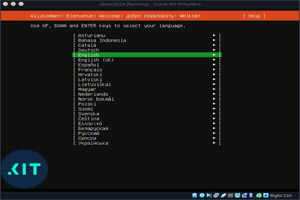
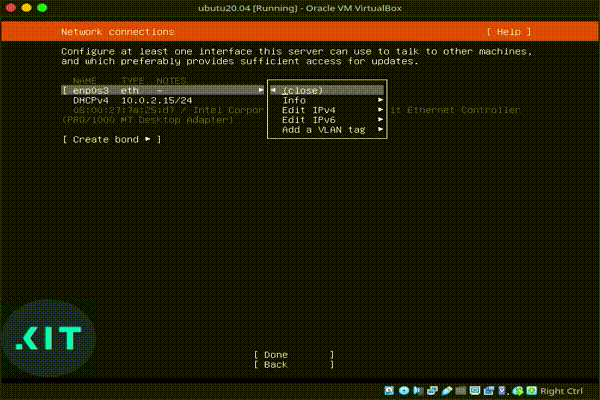
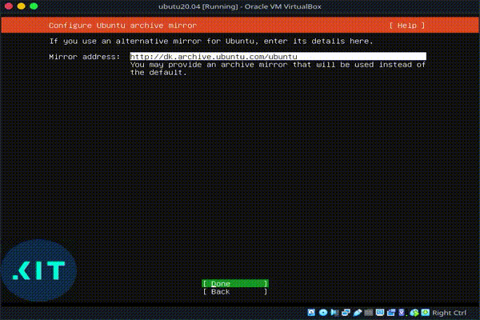

# VM specifikation
Maskinen har følgende diske:
- disk_1: 40G
  - root partition, mountpoint: /

# Hent Ubuntu server
[https://ubuntu.com/download/server](https://ubuntu.com/download/server)
 
Vælg “Option 2 - Manual server installation” og “Download Ubuntu Server 20.04.1 LTS”

[]

## Upload fil til VMware
[https://docs.vmware.com/en/VMware-vSphere/7.0/com.vmware.vsphere.vm_admin.doc/GUID-492D6904-7471-4D66-9555-9466CCCA6931.html](https://docs.vmware.com/en/VMware-vSphere/7.0/com.vmware.vsphere.vm_admin.doc/GUID-492D6904-7471-4D66-9555-9466CCCA6931.html
)

# Installer Ubuntu 20.04
Allerede installeret? Hop til [Konfigurer Ubuntu 20.04](#Konfigurer-Ubuntu-20.04)
 
Hvis ikke gennemgår vi installationsprocessen her.

## Vælg sprog
Vi vælger Engelsk som standard

[]

## Setup keyboard
Vi vælger Dansk som standard.

[]

## Netværksinstillinger
Vi disabler netværk her, da vi manuelt sætter det op efter installationen.

[]

## Proxy
Vi benytter ikke en proxy for at få forbindelse til internettet.

[]

## Ubuntu mirror
Vi benytter standard mirror som foreslået.

[]

## Setup storage
Vi har kun en enkelt disk i master serveren, så vi benytter automatisk opsætning af LVM for hele disken.
Vi skal blot lige ændre størrelsen, så hele disken bruges.

[]

## Setup profile
Konfigurering af default bruger, der har sudo rettigheder, og serverens hostname.

[]

## SSH
Vi vil gerne have installeret SSH server

[]

## Installation
Herefter kører installationsprocessen, og når den er færdig genstarter vi maskinen.

[]

# Konfigurer Ubuntu 20.04
Vi skal manuelt have konfigureret:
* netværk
* koblet maskinen på et AD domæne

## Netværk
Ubuntu 20.04 bruger *netplan* til netværkskonfiguration. Konfigurationsfilen er placeret i '/etc/netplan', og man kan finde eksempler på forskellige konfigurationer [på netplans hjemmeside](https://netplan.io/examples/)

Vi konfigurerer her i eksemplet en statisk IP på interface 'enp0s3'

[]