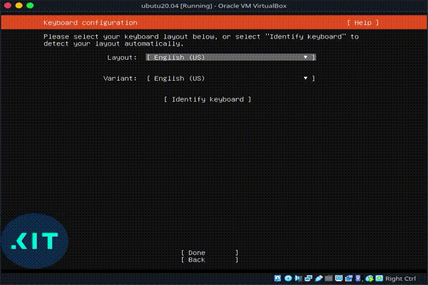
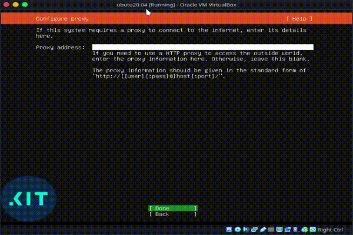
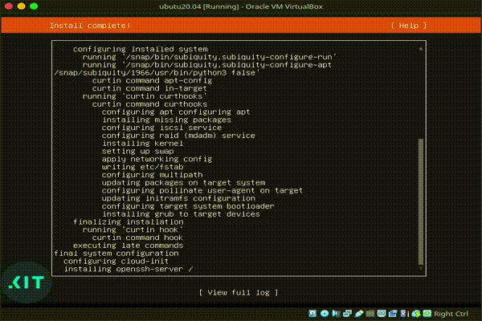

# VM specifikation
Maskinen har følgende diske:
- disk_1: 40G
  - root partition, mountpoint: /

# Installer Ubuntu 20.04

## Vælg sprog
Vi vælger Engelsk som standard

[]

## Setup keyboard
Vi vælger Dansk som standard.

[]

## Netværksinstillinger
Vi disabler netværk her, da vi manuelt sætter det op efter installationen.

[]

## Proxy
Vi benytter ikke en proxy for at få forbindelse til internettet.

[]

## Ubuntu mirror
Vi benytter standard mirror som foreslået.

[]

## Setup storage
Vi har kun en enkelt disk i master serveren, så vi benytter automatisk opsætning af LVM for hele disken.
Vi skal blot lige ændre størrelsen, så hele disken bruges.

[]

## Setup profile
Konfigurering af default bruger, der har sudo rettigheder, og serverens hostname.

[]

## SSH
Vi vil gerne have installeret SSH server

[]

## Installation
Herefter kører installationsprocessen, og når den er færdig genstarter vi maskinen.

[]