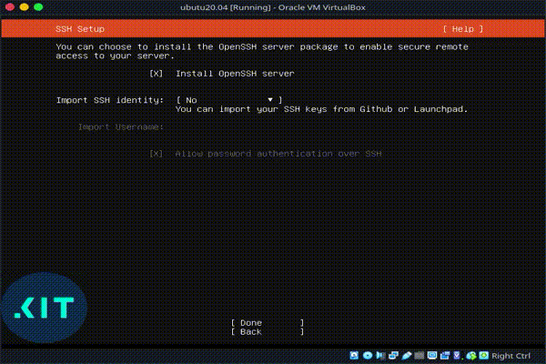

# VM specifikation
Maskinen har følgende diske:
- disk_1: 40G
  - root partition, mountpoint: /
- disk_2: 100G
  - data partition til applikationer, mountpoint: /data/applications
- disk_3: 100G
  - data partition til docker registry, mountpoint: /data/dockerregistries
- disk_4: 100G
  - data partition til monitorering-logs, mountpoint: /data/monitoring

# Installer Ubuntu 20.04

## Vælg sprog
Vi vælger Engelsk som standard

[]

## Setup keyboard
Vi vælger Dansk som standard.

[]

## Netværksinstillinger
Vi disabler netværk her, da vi manuelt sætter det op efter installationen.

[]

## Proxy
Vi benytter ikke en proxy for at få forbindelse til internettet.

[]

## Ubuntu mirror
Vi benytter standard mirror som foreslået.

[]

## Setup storage
Vi vælger først "*disk_1*", så boot-partitionen og bootloader installeres herpå når vi vælger automatisk opsætning af LVM for hele disken.
 
Først er vi nødt til at unmounte og slette root partitionen (/), for at kunne tilføje *disk_2*, *disk_3* og *disk_4* til den oprettede *LVM volume group* (ubuntu-vg). 
Herefter kan vi oprette og tilføje de resterende data partitions som *LVM logical volumes* (applications-lv, dockerregistries-lv og monitoring-lv), og til sidst oprettes root partitionen igen (ubuntu-lv).

[]

## Setup profile
Konfigurering af default bruger, der har sudo rettigheder, og serverens hostname.

[]

## SSH
Vi vil gerne have installeret SSH server.

[]

## Installation
Herefter kører installationsprocessen, og når den er færdig genstarter vi maskinen.

[]